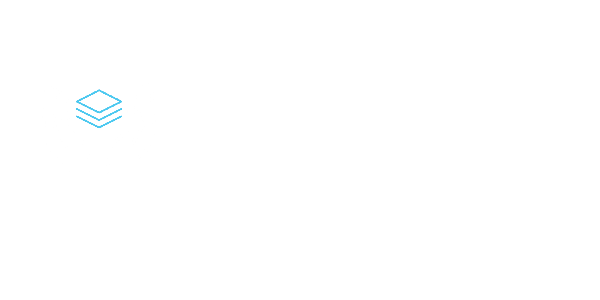

# 🖥️ DevLayers - Projeto DL Ponto
## 📑 Sumário <!-- omit in toc -->

- [📊 Business Model Canvas](#-business-model-canvas)
- [📜 Histórico de Revisão](#-histórico-de-revisão)
- [🎯 Objetivo](#-objetivo)
- [🎯 Escopo](#-escopo)
- [📖 Visão Geral](#-visão-geral)
- [✅ Requisitos Funcionais](#-requisitos-funcionais)
- [📌 Requisitos Não Funcionais](#-requisitos-não-funcionais)
## 📊 Business Model Canvas
|Principais Parceiros|Principais Atividades|Proposta de Valor|Relacionamento|Canais|Segmentos de clientes|Estrutura de custos|Fontes de renda|
|--------------------|---------------------|-----------------|--------------|------|---------------------|-------------------|---------------|
|Empresas que precisam de um sistema de controle de ponto|Desenvolvimento e manutenção do software|Facilitar o controle de jornada dos funcionários|Suporte via e-mail/chat/WhatsApp|Site oficial para apresentação e aquisição do sistema|Pequenas e médias empresas que precisam de um controle de ponto eficiente|Desenvolvimento e manutenção do sistema|Venda de licenças do software|
Desenvolvedores|Suporte técnico para empresas/clientes|Interface intuitiva e fácil de usar|Atualizações e melhorias contínuas|null|Empresas com funcionários remotos ou em diferentes turnos|Infraestrutura (hospedagem, servidores, banco de dados)|Consultoria para empresas que precisem de treinamentos|
|null|Implementação de novas funcionalidades conforme necessidades do mercado|Relatórios automatizados para análise e conformidade|Comunidade ou fórum para feedback e sugestões|null|null|Suporte e atendimento ao cliente|null|
|null|Treinamento para empresas/clientes|Possibilidade de expansão para novos recursos no futuro|null|null|null|Marketing e divulgação|null|
## 📜 Histórico de Revisão
| Data   | Versão | Descrição | Autor |
|--------|--------|-----------|-------|
| 15/02/2025 | 1.0 | Elaboração da primeira versão do documento | Rodrigo Oliveira |
| 16/02/2025 | 1.1 | Inclusão de novas entidades e atributos e detalhamento nas funcionalidades | Rodrigo Oliveira |
| 24/02/2025 | 1.2 | Formatando o arquivo corretamente e ajustando as entidades | Rodrigo Oliveira |
| 25/03/2025 | 1.3 | Personalizando documentação e inserindo tecnologias utilizadas | Rodrigo Oliveira |
## Versão 1.3
### 🎯 Objetivo
Este documento apresenta os requisitos funcionais do sistema de controle de jornada a ser desenvolvido, seguindo boas práticas de arquitetura e design de software. O desenvolvimento será acompanhado pelo professor da disciplina, Jefté Goes, garantindo a aderência às diretrizes estabelecidas.
### 🎯 Escopo
O sistema terá uma estrutura simples, com um número reduzido de entidades e funcionalidades focadas no controle de jornada. Algumas limitações serão aplicadas, como a ausência de escalas mensais ou ciclos de trabalho complexos. Entre as principais funcionalidades previstas estão:
 - Cadastro e gerenciamento de horários de trabalho;
 - Controle de banco de horas;
 - Geração de relatórios personalizados;
### 📖 Visão Geral
O sistema de ponto tem como objetivo gerenciar o controle de jornada de trabalho de funcionários de diferentes empresas, com a possibilidade de registrar entradas e saídas de forma eficiente, gerar relatórios de cálculos de horas, permitir justificativas e fornecer funcionalidades de administração e edição de registros de ponto.
## ✅ Requisitos Funcionais
### RF001 – Cadastro de Empresas
 - O sistema deve permitir o cadastro e edição de uma ou mais empresas
 - **Entrada:** Nome, inscrição estadual, CNPJ/CPF, campos de endereço, nome, cargo e e-mail do responsável pela assinatura de relatórios.
 - **Processamento:** Validação de campos obrigatórios e checagem de duplicidade.
 - **Saída:** Cadastrado com sucesso ou erro.
### RF002 – Cadastro de Horários
 - O sistema deve permitir o cadastro e edição de horários, sendo eles por carga diária ou definindo as entradas e saídas.
 - Entrada: Descrição, entradas e saídas (máximo de cinco) ou carga diária, informar o dia que é extra ou folga
 - Processamento: Validação de campos obrigatórios, confirmação se os horários inseridos estão no formato correto.
 - Saída: Cadastrado com sucesso ou erro.
### RF003 – Cadastro de Cargos
 - O sistema deve permitir o cadastro e edição de cargos.
 - Entrada: Descrição
 - Processamento: Checagem de duplicidade.
 - Saída: Cadastrado com sucesso ou erro.
### RF004 – Cadastro de Departamentos
 - O sistema deve permitir o cadastro e edição de departamentos.
 - Entrada: Descrição
 - Processamento: Checagem de duplicidade.
 - Saída: Cadastrado com sucesso ou erro.
### RF005 – Cadastro de Feriados
 - O sistema deve permitir o cadastro e edição de feriados.
 - Entrada: Descrição, data, informar se será para uma empresa específica.
 - Processamento: Checagem de duplicidade.
 - Saída: Cadastrado com sucesso ou erro.
### RF006 – Cadastro de Justificativas
 - O sistema deve permitir o cadastro e edição de justificativas
 - Entrada: Nome abreviado, descrição, informar se será contabilizado como falta em vez de abonar.
 - Processamento: Checagem de duplicidade.
 - Saída: Cadastrado com sucesso ou erro.
### RF007 – Cadastro de Funcionários
 - O sistema deve permitir o cadastro e edição de funcionários.
 - Entrada: Número de folha, nome, cpf, admissão, vincular a: empresa, horário, cargo, departamento, etc.
 - Processamento: Validação de campos obrigatórios e checagem de duplicidade.
 - Saída: Cadastrado com sucesso ou erro.
### RF008 – Inclusão de Afastamentos
 - O sistema deve permitir inclusão de afastamentos dentro da tela de cadastro do funcionário.
 - Entrada: Selecionar a justificativa, data inicial, data final e observação opcional.
 - Processamento: Validação se não há afastamentos ou abonos no período selecionado.
 - Saída: Incluído com sucesso ou erro.
### RF008 – Inclusão/Exclusão de Registros Manuais
 - O sistema deve permitir inclusão de batidas manuais na tela de cartão ponto.
 - Entrada: Horário, motivo da inclusão manual.
 - Processamento: Validação se o horário está no formato correto.
 - Saída: Incluído com sucesso ou erro.
### RF009 – Exclusão de Registros Originais
 - O sistema deve permitir a exclusão de batidas originais e manter um backup para futuras recuperações.
 - Entrada: Motivo da exclusão.
 - Processamento: Validação se o campo já está vazio.
 - Saída: Exclusão bem-sucedida.
### RF010 – Inclusão de Abonos Parciais
 - O sistema deve permitir inclusão de abonos parciais, aqueles são apenas para algumas horas de um dia especifico.
 - Entrada: Selecionar justificativa, hora inicio, hora fim, informar se abonará ou não.
 - Processamento: Validação se não há abonos no mesmo dia dentro do intervalo.
 - Saída: Inclusão bem-sucedida.
### RF011 – Gerar Relatório de Cálculos
 - O sistema deve permitir gerar relatórios em pdf ou excel da tela de cálculos onde o usuário informa quais colunas devem ir para o relatório.
 - Entrada: Colunas.
 - Processamento: Gerar arquivo e permitir salvar e selecionar diretório na máquina
 - Saída: Relatório gerado com sucesso.
### RF012 – Gerenciamento de Usuários
 - O sistema deve permitir cadastrar usuários de acesso ao sistema.
 - Entrada: Nome, senha, nível de permissão.
 - Processamento: Validação de campos obrigatórios e checagem de duplicidade.
 - Saída: Usuário cadastrado com sucesso.
### RF012 – Registro de Ponto via Aplicativo
 - O sistema deve receber os registros de ponto incluídos no aplicativo.
 - Entrada: Batidas.
 - Processamento: Validação do intervalo mínimo de 5 minutos entre uma batida e outra.
 - Saída: Registros sincronizados.
## 📌 Requisitos Não Funcionais
### RNF001 – Aplicação Desktop e Mobile
- O sistema será uma aplicação desktop, com um aplicativo mobile disponível apenas para os funcionários registrarem o ponto.
### RNF002 – Segurança dos Registros de Ponto
- O sistema deve ser seguro, garantindo que apenas administradores possam realizar alterações nos registros de ponto.
### RNF003 – Gestão de Múltiplas Empresas
- O sistema deve permitir a gestão de múltiplas empresas de forma independente.
### RNF004 – Interface Intuitiva
- A interface do usuário deve ser intuitiva e de fácil navegação.
### RNF005 – Exportação de Relatórios
- O sistema deve permitir a exportação de relatórios em formatos como PDF ou Excel.
## 📌 Tecnologias Utilizadas
Este projeto utiliza as seguintes tecnologias e ferramentas:
- **Java** – Linguagem de programação principal
- **Maven** – Gerenciador de dependências
- **MySQL** – Banco de dados relacional
- **Spring Boot** – Framework para desenvolvimento backend, incluindo:
  - **Spring JPA** – Persistência de dados
  - **Spring REST API** – Criação de endpoints para comunicação
  - **Spring Boot Starter MySQL** – Integração com banco de dados
- **Postman** – Testes e validação da API
## Equipe
<ul>
<li><a href="https://github.com/umsimplesrodrigo">Rodrigo Oliveira</a></li>
<li><a href="https://github.com/Lys-31">Laís Santana</a></li>
<li><a href="https://github.com/vinisantosx">Vinícius Almeida</a></li>
<li><a href="https://github.com/TxeiraFp">João Felipe</a></li>
<li><a href="https://github.com/ELPATON">Matheus Alcântara</a></li>
</ul>
